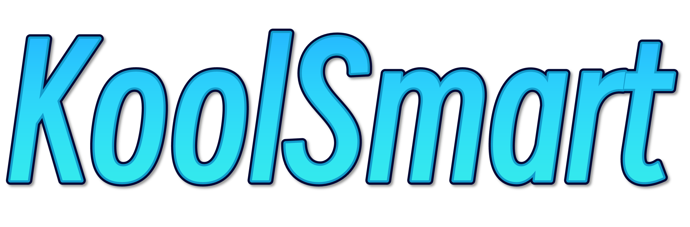
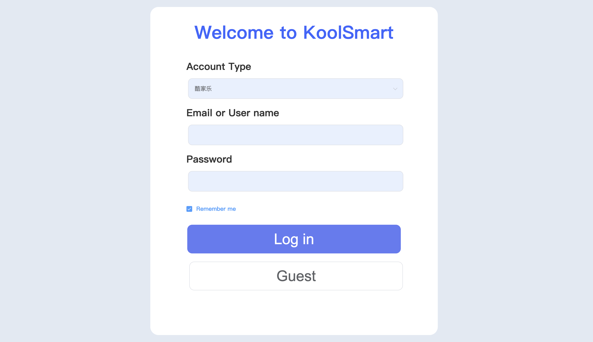
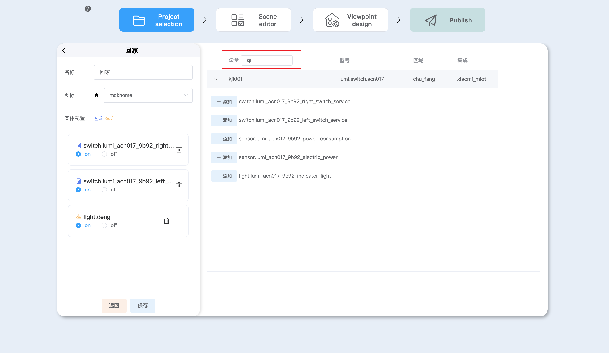
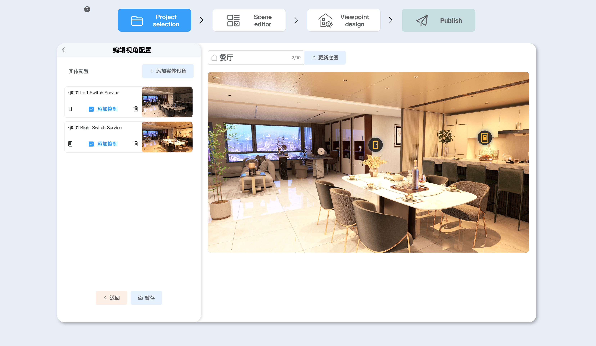
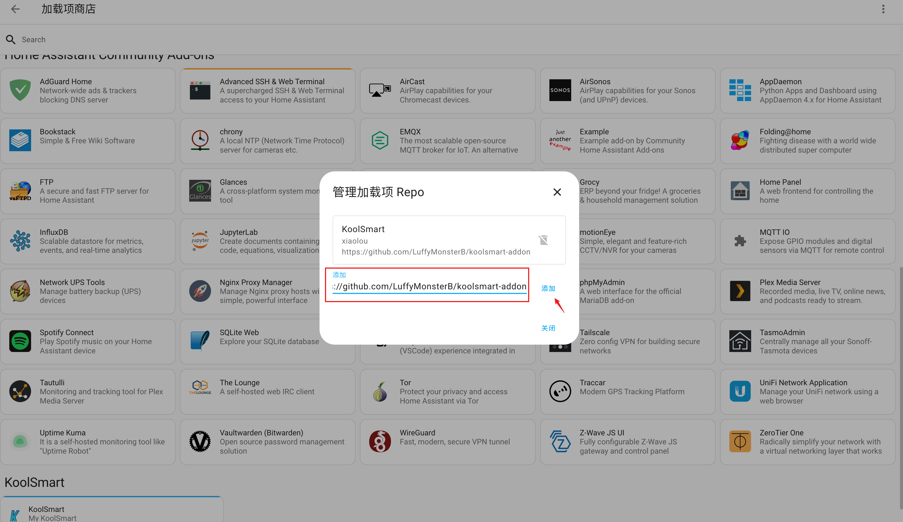
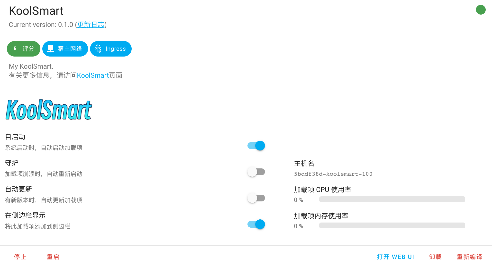

 
realize imagination

  

    
    
<!--      -->	
     

## 🌟 Introduction

- **KoolSmart** is a powerful tool that empowers Home Assistant users to create their own smart home panel without any
  programming background.
- **With KoolSmart**, you can easily drag and drop icons, set background images, and customize the UI through a
  user-friendly interface. Take your automated home to the next level by exploring our extensive collection of
  high-quality add-ons.
- **Additionally**, if you're in the spirit of discovery, you can manually extend Koolsmart's functionality to meet your
  specific needs.

## 🍭 Usage

- **Video tutorials:**

  - bilibili：https://www.bilibili.com/video/BV1vu4y1H7ms/

  - youtube：https://www.youtube.com/watch?v=qETuxxx1-vM

  - coohom：https://blog.coohom.com/enchanting-home-automation-unveiling-the-magic-of-koolsmart-for-intelligent-lighting-and-control/

- You can use your [Kujiale Account](https://www.kujiale.com/) to log in and load the designed projects.

  

  
  

- Create or edit your own dashboard project.

- Create a new scenario mode to combine the switching states of the lights, e.g. in home mode, turn on xx lights, turn
  on xx lights; in away from home mode, turn off xx lights, turn off xx lights

  

  
  

- Then go to design the effect of turning on the light in each viewpoint, you can choose the dark map of the area as the
  base map, and then add a single light rendering, the device also supports individual control, free to change and place
  the mdi icon!

  

  
  

- On the preview publish page, you can see all the configurations under the current dashboard and verify the correctness
  of the scenario mode's light on, making it easy to go back and forth to modify it.

- Once published, a new dashboard can be generated in the HA system, which can be used on tablet devices as a smart
  central control platform for virtual reality linkage.

  

  
  

## 🚀 Installation

- **Home Assistant Installation:** https://www.home-assistant.io/installation/

- **Copy GitHub Link:** https://github.com/manycore-koolab/KoolSmart

- **Install in Home Assistant Add-ons Store:**

  1. In Home Assistant, click on "Settings" -> "Add-ons" -> "Add-ons Store".
  2. Click on the upper right corner `...` , and then click on `repository`.
  3. Paste the github link and click `add`.
  4. Wait a minute, You can see koolsmart in the add-ons store.
  5. click on "Install" to install it.

  

  
  

- **Enjoy Your KoolSmart:** Start the Koolsmart add-on and open the web user interface (UI) by clicking on "Open Web
  UI".

  

  
  

## 🐛 Issues

If you have any questions, you can submit them to the Issues module, and we will fix them.

## 💻 Community

English：https://community.home-assistant.io/t/koolsmart1-0-connect-exquisite-renderings-visually-configure-devices-and-easily-publish-dashboards/670374

Chinese：https://bbs.hassbian.com/thread-23638-1-1.html

## 🌝 Authors & Contributors

## 📄 License

This project is licensed under [GPL](LICENSE).
